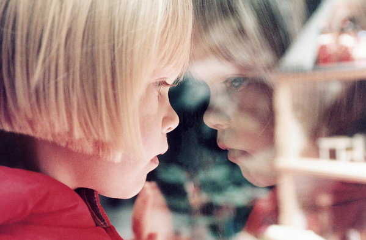

# Project Overview

We aimed to remove the undesired reflections when taking pictures through transparent glasses. The existing
“ghosting model” failed to process pictures with repetitive patterns. After I modified the model and proposed a new
regularization term in the optimization problem, my algorithm achieved better performances than the original one on
both artificial images and some of the natural images.

``/code/origin`` contains the code of the original "ghosting model" I started with, credited to YiChang Shih (https://www.yichangshih.com/)

# Introduction

When taking pictures through transparent glasses, we often obtain images with undesired reflections. This is a common issue in daily lives and much effort has been devoted to separate the transmitted background layer and the undesired reflection layer. 

<picture>
  <source media="(prefers-color-scheme: dark)" srcset="./images/bulb.jpg" width="400">
  
</picture>

<picture>
  <source media="(prefers-color-scheme: dark)" srcset="./images/girl.jpg" width="400">
  
</picture>

One natural idea is to view the input image as a linear superposition of two different layers: $\mathbf{Y} = \mathbf{T} + \mathbf{R}$, where $\mathbf{Y}$ denotes the known input image, $\mathbf{T}$ and $\mathbf{R}$ represent the unknown transmission layer and reflection layer respectively. Our goal is to obtain $\mathbf{T}$ and $\mathbf{R}$ from input $\mathbf{Y}$. This single equation, however, is not enough to achieve the decomposition, and a variety of approaches have been proposed to make this problem tractable, which could be divided mainly into two categories. One is to deal with the left hand side of the equation: increase the number of input images containing the same layers, usually they are pictures of the same scene but taken from slightly different viewpoints; the other is to deal with the right hand side of the equation: use one single input image and impose strong prior knowledge. 

A large amount of earlier work takes multiple images or a video clip as input to effectively explore the relationship between $\mathbf{T}$ and $\mathbf{R}$ and they had fairly good results. Later work (*K. Gai, Z. Shi, and C. Zhang*, 2008 and 2012) tries to reduce the number of input images and impose stronger priors at the same time. 

As pointed out by *Reflection Removal Algorithms* (*Hu*, 2016), compared to algorithms that use a single input, those who operate on a series of images usually have much better performances since they have imposed a higher level of prior knowledge. Most of the practical post-processing problems, however, appear with only one single image, and these multiple-image based methods are not applicable to general cases. Therefore, this paper focuses on developing a robust single-image based method. 
    
The question is, to effectively separate the two layers from only one single input, what kind of prior would be essentially helpful? One straightforward idea is that the two independent layers we extract are natural images. *User Assisted Separation of Reflections from a Single Image Using a Sparsity Prior* (*A. Levin and Y. Weiss*, 2007) utilizes the *sparse distribution* property of natural images, using a Laplacian mixture model to constrain the distribution of the input gradients. *Sparsity based reflection removal using external patch search* (*R. Wan et al.*, 2017) also adopts the gradient sparsity prior to regularize $\mathbf{R}$. Besides priors derived from the statistics of natural images, some other special features are also found to be helpful. Based on the observation that the correct decomposition is into two *smooth* natural images instead of arbitrary fragments, *Separating reflections from a single image using local features* (*A. Levin, et al.* 2004) makes use of simple edges and corners operators, intuitively searching for a decomposition which minimizes the total number of edges and corners.

Furthermore, researchers have tried to break the symmetry between $\mathbf{T}$ and $\mathbf{R}$, whose methods focus more on *differentiation*. *Single Image Layer Separation Using Relative Smoothness* (*Y. Li and M. S. Brown*, 2014) exploits relative smoothness between the two layers, *Automatic Reflection Removal using Gradient Intensity and Motion Cues* (*Sun, et al.*, 2016) notices that edges in $\mathbf{R}$ often have lower intensities than that in $\mathbf{T}$. However, these features still fail to agree with a large amount of images, and a stronger and more general observation is needed. 

Recently a new model proposed by *Y. Shih* (*Reflection removal using ghosting cues*, 2015) has outperformed many existing single-image based methods. Depending on the ghosting phenomenon that the reflection always appears with a shifted and attenuated version of itself, they formulate the model as $\mathbf{Y} = \mathbf{T} + \mathbf{R} \otimes \mathbf{k}$ and combine it with a patch-based GMM (Gaussian Mixture Model) prior. Here $\mathbf{k}$ is the ghosting kernel consists of the shifting parameter $\mathbf{d}_k$ and the attenuation parameter $c_k$, in other words, $\mathbf{R} \otimes \mathbf{k} (\mathbf{x}) = \mathbf{R}(\mathbf{x}) + c_k\mathbf{R}(\mathbf{x} - \mathbf{d}_k)$ where $\mathbf{x}$ is a two dimensional vector representing a single pixel. 

This model, however, fails to process images with repetitive pattern in the transmission layer. Therefore, *Removing Reflection From a Single Image With Ghosting Effect* (*Y. Huang et al.*, 2019) replaced the GMM prior by a more detailed prior containing information about the differences of the repetitive pattern between $\mathbf{T}$ and $\mathbf{R}$ so that the algorithm could tell to which layer does a certain pixel belong. 

Motivated by *Y. Shih* and *Y. Huang et al.*, this paper aims to improve the reflection removal performance based on their ghosting model by the following three ways: polish the estimation of the ghosting kernel $\mathbf{k}$, design a more robust model than $\mathbf{Y} = \mathbf{T} + \mathbf{R} \otimes \mathbf{k}$, and impose stronger regularization terms.

