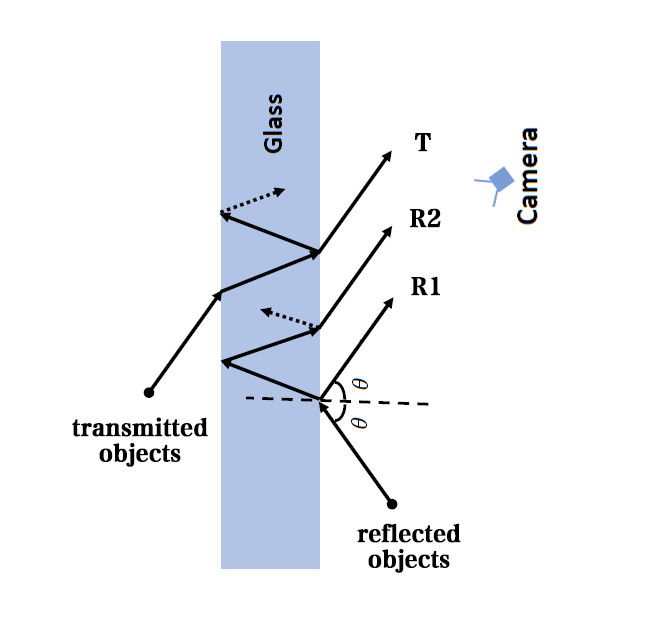
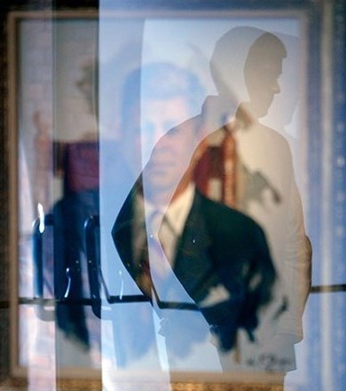
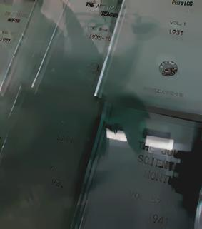
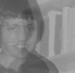

# Project Overview

This was the project I worked on for my undergraduate thesis *Reflection Removal: Improvements of the Ghosting Model* (2015) at Tsinghua University.

We aimed to remove the undesired reflections when taking pictures through transparent glasses. The existing
“ghosting model” failed to process pictures with repetitive patterns. After I modified the model and proposed a new
regularization term in the optimization problem, my algorithm achieved better performances than the original one on
both artificial images and some of the natural images.

``/code/origin`` contains the code of the original "ghosting model" I started with, credited to YiChang Shih (https://www.yichangshih.com/)

``/code/new`` constains the code of my own work based on the original model.

# Introduction

When taking pictures through transparent glasses, we often obtain images with undesired reflections. This is a common issue in daily lives and much effort has been devoted to separate the transmitted background layer and the undesired reflection layer. 

<picture>
  <source media="(prefers-color-scheme: dark)" srcset="./images/bulb.jpg" width="400">
  
</picture>

<picture>
  <source media="(prefers-color-scheme: dark)" srcset="./images/girl.jpg" width="400">
  
</picture>

One natural idea is to view the input image as a linear superposition of two different layers: 

$$\mathbf{Y} = \mathbf{T} + \mathbf{R} \quad\text{(ill posed)},$$

where $\mathbf{Y}$ denotes the known input image, $\mathbf{T}$ and $\mathbf{R}$ represent the unknown transmission layer and reflection layer respectively. Our goal is to obtain $\mathbf{T}$ and $\mathbf{R}$ from input $\mathbf{Y}$. This single equation, however, is not enough to achieve the decomposition, and a variety of approaches have been proposed to make this problem tractable, which could be divided mainly into two categories. One is to deal with the left hand side of the equation: increase the number of input images containing the same layers, usually they are pictures of the same scene but taken from slightly different viewpoints; the other is to deal with the right hand side of the equation: use one single input image and impose strong prior knowledge. 

A large amount of earlier work takes multiple images or a video clip as input to effectively explore the relationship between $\mathbf{T}$ and $\mathbf{R}$ and they had fairly good results. Later work (*K. Gai, Z. Shi, and C. Zhang*, 2008 and 2012) tries to reduce the number of input images and impose stronger priors at the same time. 

As pointed out by *Reflection Removal Algorithms* (*Hu*, 2016), compared to algorithms that use a single input, those who operate on a series of images usually have much better performances since they have imposed a higher level of prior knowledge. Most of the practical post-processing problems, however, appear with only one single image, and these multiple-image based methods are not applicable to general cases. Therefore, this paper focuses on developing a robust single-image based method. 
    
The question is, to effectively separate the two layers from only one single input, what kind of prior would be essentially helpful? One straightforward idea is that the two independent layers we extract are natural images. *A. Levin and Y. Weiss* (2007) utilizes the **sparse distribution** property of natural images, using a Laplacian mixture model to constrain the distribution of the input gradients. *R. Wan et al.* (2017) also adopts the gradient sparsity prior to regularize $\mathbf{R}$. Besides priors derived from the statistics of natural images, some other special features are also found to be helpful. Based on the observation that the correct decomposition is into two *smooth* natural images instead of arbitrary fragments,  *A. Levin, et al.* (2004) makes use of simple edges and corners operators, intuitively searching for a decomposition which minimizes the total number of edges and corners.

Furthermore, researchers have tried to break the symmetry between $\mathbf{T}$ and $\mathbf{R}$, whose methods focus more on **differentiation**. *Y. Li and M. S. Brown* (2014) exploits relative smoothness between the two layers, *Sun, et al.* (2016) notices that edges in $\mathbf{R}$ often have lower intensities than that in $\mathbf{T}$. However, these features still fail to agree with a large amount of images, and a stronger and more general observation is needed. 

Recently a new model proposed by *Y. Shih* (*Reflection removal using ghosting cues*, 2015) has outperformed many existing single-image based methods. Depending on the ghosting phenomenon that the reflection always appears with a shifted and attenuated version of itself, they formulate the model as 

$$\mathbf{Y} = \mathbf{T} + \mathbf{R} \otimes \mathbf{k}$$

and combine it with a patch-based GMM (Gaussian Mixture Model) prior. Here $\mathbf{k}$ is the ghosting kernel consists of the shifting parameter $\mathbf{d}\_k$ and the attenuation parameter $c\_k$, in other words, 

$$\mathbf{R} \otimes \mathbf{k} (\mathbf{x}) = \mathbf{R}(\mathbf{x}) + c_k\mathbf{R}(\mathbf{x} - \mathbf{d}\_k)$$

where $\mathbf{x}$ is a two dimensional vector representing a single pixel. 

This model, however, fails to process images with repetitive pattern in the transmission layer. Therefore, *Y. Huang et al.* (2019) replaced the GMM prior by a more detailed prior containing information about the differences of the repetitive pattern between $\mathbf{T}$ and $\mathbf{R}$ so that the algorithm could tell to which layer does a certain pixel belong. 

Motivated by *Y. Shih* and *Y. Huang et al.*, this paper aims to improve the reflection removal performance based on their ghosting model by the following three ways: polish the estimation of the ghosting kernel $\mathbf{k}$, design a more robust model than $\mathbf{Y} = \mathbf{T} + \mathbf{R} \otimes \mathbf{k}$, and impose stronger regularization terms.

# Main Idea

The original optimization problem was formed as follows:

$$\min_{\mathbf{T},\mathbf{R}} \quad  \frac{1}{2}\|\mathbf{Y} - \mathbf{T} - \mathbf{R} \otimes \mathbf{k}\|\_F^2 + \lambda\sum\_i\|\mathbf{A} \odot (f\_i \otimes \mathbf{T})\|\_1 + \beta\sum\_i\|(1 - \mathbf{A}) \odot (f\_i \otimes \mathbf{R})\|\_1,$$

where $\{f_i\}\_{i = 1}^L$ is the filter bank of a wavelet transform, $\mathbf{A}$ is the weighting matrix encoding the information distinguishing $\mathbf{T}$ and $\mathbf{R}$ and $\odot$ represents pixel-wise multiplication. They use split-Bregman method to solve this optimization problem after estimating ghosting kernel $\mathbf{k}$ and the weighting matrix $\mathbf{A}$. More details could be found in *Removing Reflection From a Single Image With Ghosting Effect* (*Y. Huang et al.*, 2019).

Our goal is to obtain better estimation of $\mathbf{k}$, choose better image blending mode $f$ as well as better regularization terms $\Gamma(\mathbf{T},\mathbf{R})$ in the following generalized model.

$$\min_{\mathbf{T},\mathbf{R}} \quad  \frac{1}{2}\|\mathbf{Y} - f(\mathbf{T}, \mathbf{R} \otimes \mathbf{k})\|\_F^2 + \Gamma(\mathbf{T}, \mathbf{R}).$$

The rest of this chapter will describe how we achieve our goals mentioned above based on the methods proposed by *Y. Shih* and *Y. Huang et al.*.

## Kernel Estimation

Given an input image, the very first step is to estimate the ghosting kernel $\mathbf{k} = (\mathbf{d}\_k, c_k)$. Only by obtaining the right ghosting kernel can we separate the two layers correctly since the kernel $\mathbf{k}$ is the key to detect the reflection layer $\mathbf{R}$. However, the algorithm used by *Y. Shih* and *Y. Huang et al.* can be problematic in many situations, therefore, following their framework, we improve some details and give a more accurate estimation of $\mathbf{k}$.

The original method is to first estimate $\mathbf{d}\_k$ then estimate $c\_k$. To estimate $\mathbf{d}\_k$, they search for the vector that maximizes the autocorrelation map of the edge map of $\mathbf{Y}$, based on the idea that by shifting the input image $\mathbf{d}\_k$, it would overlap itself to the full extent. If we denote $E_{\mathbf{Y}}$ as the edge map of $\mathbf{Y}$, $\mathcal{R}\_s$ as the autocorrelation function of signal $s$, we have:

$$\mathbf{d}_k = \arg\max_{\mathbf{d}} \mathcal{R}\_{E_{\mathbf{Y}}}(\mathbf{d}).$$

To estimate $c_k$, they detect all the corners of the input image, then extract patches around these corners and shift them $\mathbf{d}\_k$ to get pairs of patches, finally compute the weighted average of all the relative attenuation between those patch pairs. Let $\mathbf{p}\_1^j$ denote the $p \times p$ patch around the $j$-th corner point, $\mathbf{p}\_2^j(\mathbf{x}) = \mathbf{p}\_1^j(\mathbf{x} + \mathbf{d}\_k)$ is another $p \times p$ patch obtained by shifting $\mathbf{p}\_1^j$ the distance $\mathbf{d}\_k$. If we denote $\text{attn}\_j$ as the relative attenuation between the patch pair $\mathbf{p}\_1, \mathbf{p}\_2$, $w_j$ as the weight to decide how much should this attenuation of the $j$-th corner contribute to the final attenuation factor $c_k$, we have:

$$c_k = \frac{\sum_jw_j\text{attn}\_j}{\sum_jw_j}.$$

When the transmission layer $\mathbf{T}$ has strong repetitive pattern, however, this algorithm would probably take $\mathbf{d}\_k$ from the transmission layer $\mathbf{T}$ and result in incorrect $c_k$. It is important to mention that, the weighting matrix $\mathbf{A}$ in the original model works only when we get the right $\mathbf{k}$. Suppose we get the right estimation of $\mathbf{k}$, and the patterns in $\mathbf{T}$ and $\mathbf{R}$ share the same $\mathbf{d}\_k$, the algorithm could tell whether a pixel belongs to $\mathbf{T}$ or $\mathbf{R}$ with the help of $\mathbf{A}$, but it could not help us find the right $\mathbf{k}$ in the very beginning. To solve this, we combine the estimation of $\mathbf{d}\_k$ and $c_k$. We hope that the wrong $\mathbf{d}\_k$ derived from the repetitive pattern in $\mathbf{T}$ would result in $c_k \approx 1$, so that among the local maximum points of $\mathcal{R}\_{E_{\mathbf{Y}}}(\mathbf{d})$ we could discard those $\mathbf{d}\_k$ whose corresponding $c_k$ is close to 1. Therefore, we are left to improve the estimation of $c_k$ so that the wrong $\mathbf{d}\_k$ derived from the repetitive pattern in $\mathbf{T}$ would result in $c_k \approx 1$.

## New Model

So far most of the previous works take the input digital image as the direct addition of several digital images. When implementing the primary model $\mathbf{Y} = \mathbf{T} + \mathbf{R}$, for example, "+" is used as the pixel-wise addition. 

<picture>
  <source media="(prefers-color-scheme: dark)" srcset="./images/ghost.png" width="400">
  
</picture>

The physical formation of the ghosting model $\mathbf{Y} = \mathbf{T} + \mathbf{R} \otimes \mathbf{k}$ is shown in Figure \ref{fig:ghost}, where intuitively, the input image we get is the "addition" of $\mathbf{T}$, $\mathbf{R}\_1$ and $\mathbf{R}\_2$ optically, where $\mathbf{R}\_2$ is a shifted and attenuated version of the reflection $\mathbf{R}\_1$. However, the images we process and recover are digital images, in other words, the physical model $\mathbf{Y} = \mathbf{T} + \mathbf{R}\_1 + \mathbf{R}\_2$ does not imply $g(\mathbf{Y}) = g(\mathbf{T}) + g(\mathbf{R}\_1) + g(\mathbf{R}\_2)$ where $g$ transforms them into digital images. Moreover, there are many other situations where the physical model $\mathbf{Y} = \mathbf{T} + \mathbf{R} \otimes \mathbf{k}$ does not hold, as shown in Figure \ref{fig:otherMode}, the pixel-wise addition would make the mixture image lighter than the two layers it consists of. While the reflections in the above two images act as "shadows" which instead dim the transmission layer, it is because the transmitted objects will not glow in this case.

<picture>
  <source media="(prefers-color-scheme: dark)" srcset="./images/book.jpg" width="300">
  
</picture>

<picture>
  <source media="(prefers-color-scheme: dark)" srcset="./images/portrait.png" width="300">
  
</picture>

Therefore, we aim to find a new model $\mathbf{Y} = f(\mathbf{T}, \mathbf{R} \otimes \mathbf{k})$ that could cover a wider range of situations. Inspired by the opacity blending mode in Photoshop, we construct a new model as:

$$\mathbf{Y} = \delta\mathbf{T} + (1 - \delta) (\mathbf{R} \otimes \mathbf{k})$$

where $\delta \in (0,1)$ indicates the opacity of the transmission layer $\mathbf{T}$.

## Regularization Term

As shown in the following figure, The image on the left side is the input image, we combine the new model $\mathbf{Y} = 0.3\mathbf{T} + 0.7(\mathbf{R} \otimes \mathbf{k})$  with the original methods to get the recovered transmission layer $\mathbf{T}$ in the middle and the recovered reflection layer $\mathbf{R}$ on the right. We notice that sometimes the original algorithm could successfully recover the reflection layer $\mathbf{R}$, but the transmission layer $\mathbf{T}$ is still left with the shadow of $\mathbf{R}$, which means the original regularization terms are good at detecting the two layers but still unable to achieve clean separation. We therefore propose a new regularization term to also minimize the correlation between $\mathbf{T}$ and $\mathbf{R}$.

<picture>
  <source media="(prefers-color-scheme: dark)" srcset="./images/book.jpg" width="240">
  
</picture>

<picture>
  <source media="(prefers-color-scheme: dark)" srcset="./images/initT_d_book.jpg" width="240">
  
</picture>

<picture>
  <source media="(prefers-color-scheme: dark)" srcset="./images/initR_d_book.jpg" width="240">
  
</picture>

# Implementation

This chapter will describe how we implement the new ideas stated in Chapter \ref{cha:idea}, present and discuss the results of our experiments.

## Kernel Estimation
We aim to improve the estimation of $c_k = \sum_jw_j\text{attn}\_j/\sum_jw_j$ so that the wrong $\mathbf{d}_k$ derived from the repetitive pattern in $\mathbf{T}$ would result in $c_k \approx 1$. We write $w\_j$ and $\text{attn}\_j$ as follows:

$$ w_j = \exp(10(\text{score}\_j-1))$$

$$\text{attn}\_j = \sum\_i \beta_i\frac{\bar{\mathbf{p}}\_2(i) + \varepsilon}{\bar{\mathbf{p}}\_1(i) + \varepsilon} / \sum_i \beta_i$$

where $\text{score}\_j = \frac{\sum(\mathbf{p}\_1^j \odot \mathbf{p}\_2^j)}{\|\mathbf{p}\_1^j\|\_F\|\mathbf{p}\_2^j\|\_F}$ encodes the similarity between the two patches around the $j$-th corner, and the weight $w_j$ is positively correlated with $\text{score}\_j$; $\bar{\mathbf{p}}\_1, \bar{\mathbf{p}}\_2$ are obtained by convolving $\mathbf{p}\_1,\mathbf{p}\_2$ with a 3 by 3 average filter and $\beta_i$ is the weight of the $i$-th estimation $\frac{\bar{\mathbf{p}}\_2 + \varepsilon}{\bar{\mathbf{p}}\_1 + \varepsilon}$. $\beta_i$ is designed to be larger if the $i$-th pixel is closer to the center of the patch, for that we want to reduce the influence of the background.

Now we let $\mathbf{d}\_k$ be the maximum point of $\mathcal{R}\_{E\_{\mathbf{Y}}}(\mathbf{d})$ after eliminating those local maximum points whose corresponding $c_k$ is close to 1. We implement the new algorithm on the following figure and obtain an accurate estimation of the ghosting kernel, while the original algorithm takes the wrong $\mathbf{d}\_k$ from the pattern in $\mathbf{T}$. The ground-truth ghosting kernel of this demo is $[dx,dy,c] = [10,-10,0.80]$, the pattern in the background gives $[dx,dy] = [-22,-22]$. The results of the original algorithm is $[dx,dy,c] = [21,22,0.68]$, the results of our proposed algorithm is $[dx,dy,c] = [10,-10,0.87]$.

<picture>
  <source media="(prefers-color-scheme: dark)" srcset="./images/cTestdemo.jpg" width="300">
  
</picture>

## Optimization

We set $\delta = 0.3 \text{ or } 0.5$, utilizing the new model and the new regularization term, our optimization problem becomes:

$$\min_{\mathbf{T},\mathbf{R}} \quad \frac{1}{2}\|\mathbf{Y} - \delta\mathbf{T} - (1-\delta)(\mathbf{R} \otimes \mathbf{k})\|\_F^2 + \lambda\sum\_i\|\mathbf{A}\odot(f\_i \otimes \mathbf{T})\|\_1 + \beta\sum_i\|(1-\mathbf{A})\odot(f_i\otimes\mathbf{R})\|\_1 + \gamma\|\frac{\mathbf{R}\odot\mathbf{T}}{\|\mathbf{R}\|\_F\|\mathbf{T}\|\_F}\|\_1$$

Implementing alternating minimization, we split this problem into two subproblems as follows:

$$\min_{\mathbf{R}} \quad \frac{1}{2}\|\mathbf{Y} - \delta\mathbf{T} - (1-\delta)(\mathbf{R} \otimes \mathbf{k})\|\_F^2 + \beta\sum\_i\|(1-\mathbf{A})\odot(f_i\otimes\mathbf{R})\|\_1 + \gamma\|\frac{\mathbf{T}\odot\mathbf{R}}{\|\mathbf{T}\|_F\|\mathbf{R}\|\_F}\|_1$$

$$\min_{\mathbf{T}} \quad \frac{1}{2}\|\mathbf{Y} - (1-\delta)(\mathbf{R} \otimes \mathbf{k}) - d\mathbf{T} \|\_F^2 + \lambda\sum_i\|\mathbf{A}\odot(f_i \otimes \mathbf{T})\|\_1 + \gamma\|\frac{\mathbf{R}\odot\mathbf{T}}{\|\mathbf{R}\|\_F\|\mathbf{T}\|\_F}\|\_1$$

Each subproblem is a standard $l_1$ minimization problem of the  form $\min_{\mathbf{u}} \|\mathbf{g} - \mathbf{B}\mathbf{u}\|\_2 + \|\mathbf{D}\mathbf{u}\|\_1$, which could be solved by the split-Bregman method \cite{split}.

As for initialization, let $\mathbf{T} = \mathbf{Y}$, $\delta = 0.5$, set all the entries of $\mathbf{A}$ to be 0.5 and run the above algorithm 5 times to get the initial $\mathbf{T}$ and $\mathbf{R}$.

We test our new algorithm on both synthetic images and real images. In the following diagrams, the figure on the left is the input image, the figure in the middle is the recovered result of the original algorithm, and the figure on the right is the recovered result of our new algorithm. They both show that we obtain much better results when processing images with simple transmission layer. 

<picture>
  <source media="(prefers-color-scheme: dark)" srcset="./images/shadowSyn.png" width="240">
  
</picture>
<picture>
  <source media="(prefers-color-scheme: dark)" srcset="./images/T_shadowSyn.png" width="240">
  
</picture>
<picture>
  <source media="(prefers-color-scheme: dark)" srcset="./images/T_r_shadowSyn.png.png" width="240">
  
</picture>

<picture>
  <source media="(prefers-color-scheme: dark)" srcset="./images/book.jpg" width="240">
  
</picture>
<picture>
  <source media="(prefers-color-scheme: dark)" srcset="./images/T_book.jpg" width="240">
  
</picture>
<picture>
  <source media="(prefers-color-scheme: dark)" srcset="./images/T_r_book.jpg" width="240">
  
</picture>

We also find that when dealing with more complicated $\mathbf{T}$, the new regularization term would sacrifice the details in the transmission layer in order to achieve "clear" separation of the two layers, as shown in the following diagram.

<picture>
  <source media="(prefers-color-scheme: dark)" srcset="./images/Lake.jpg" width="240">
  
</picture>
<picture>
  <source media="(prefers-color-scheme: dark)" srcset="./images/lake_deghost.jpg" width="240">
  
</picture>
<picture>
  <source media="(prefers-color-scheme: dark)" srcset="./images/T_r_Lake.jpg" width="240">
  
</picture>

